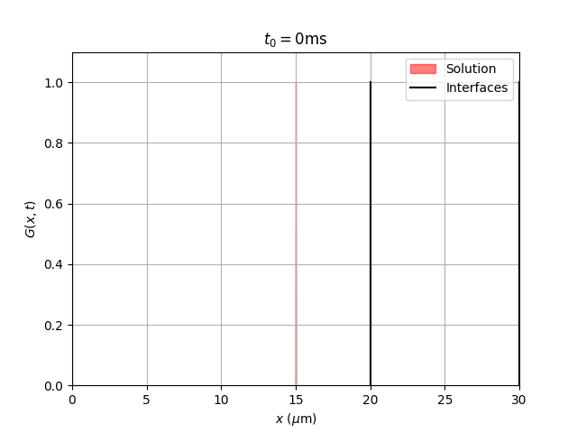

# Diffusion Models

[Analytical](#analytical-solution) and [random walk](#monte-carlo-random-walk) models of diffusion in permeable layered media.

## Installation

Quick-start: `pip install git+https://github.com/janniklasrose/diffusion-models.git`

See [INSTALL.md](./INSTALL.md) for details.

## Documentation

The [docs](./docs/) directory contains 

## Methods

### Analytical solution

A semi-analytical solution was first proposed by [Moutal & Grebenkov](https://doi.org/10.1007/s10915-019-01055-5).
We present an improved algorithm to find the eigenvalues (roots of the transcendental equation), which is fast and robust.
The original algorithm is dependent on several input parameters and may lead to missed roots.
This new approach recursively fits Chebyshev polynomials, which are represented by [chebpy](https://github.com/chebpy/chebpy) (similar to [Chebfun](http://chebfun.org)).

An example of the time-varying diffusion solution is shown in this animation:

### Monte Carlo random walk

For higher-dimensional (2D and 3D) cases, there exists no analytical solution to the diffusion problem.
Monte Carlo random walk simulations are commonly used in these situations as they are fast and versatile.
However, care must be taken to handle discontinuities correctly.
We provide a random walk code to investigate different membrane permeability models (transit models) by comparing the results to the analytical solution.

### Problem scaling

Working in SI units is usually encouraged for consistency.
However, given the physical scales of the modelled geometries and processes, it is convenient to find a scaling that results in parameter values near unity.
This can also help to reduce numerical error.
The following table illustrates a consistent choice for units.

|   Parameter  |  Symbol |        Unit       |      Scale      |
| ------------ |:-------:| ----------------- |:---------------:|
| Length       | `L`/`x` | µm                | 10-6 |
| Time         |   `t`   | ms                | 10-3 |
| Diffusivity  |   `D`   | µm2/ms | 10-9 |
| Permeability |   `K`   | µm/ms             | 10-3 |
